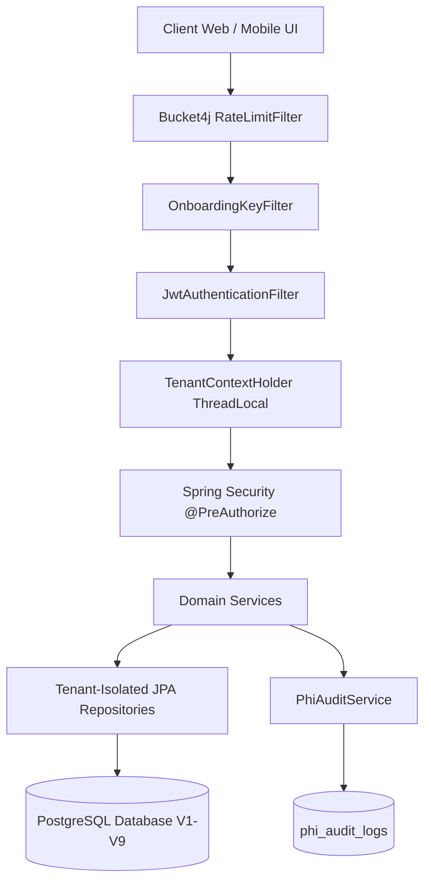
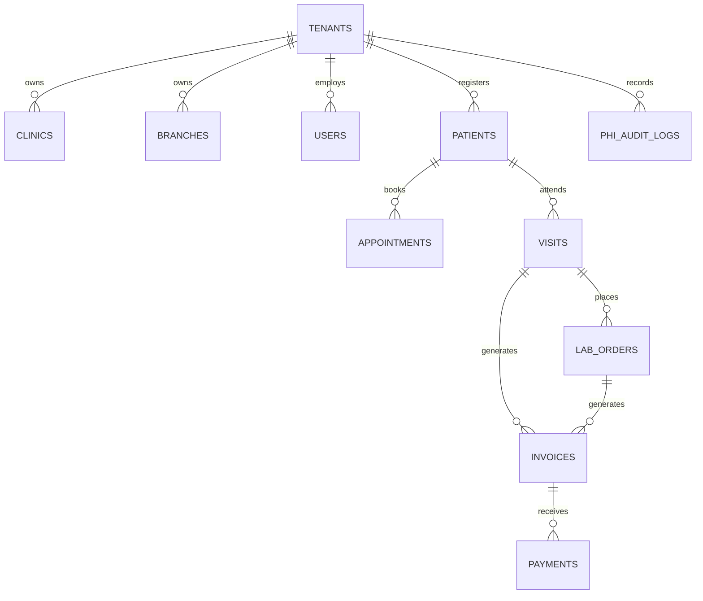
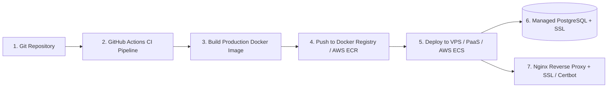

# CareBridge — Enterprise Multi-Tenant Healthcare Information System (HIS) Backend

**CareBridge** is an enterprise-grade multi-tenant Healthcare Information System (HIS) and Practice Management SaaS backend built with **Java 21**, **Spring Boot 3**, and **PostgreSQL**.

It provides complete digital management for clinics, diagnostic centers, and multi-branch healthcare organizations — covering patient management, appointment scheduling with real-time schedule conflict resolution, clinical encounters, diagnostic laboratory workflows, automated billing/invoicing, payment processing, HIPAA/PHI audit compliance, and multi-branch operations.

---

## 🌟 Architectural Highlights



- **Strict Multi-Tenancy & Data Isolation**: Every patient, visit, lab order, invoice, and payment is isolated per tenant (`tenant_id`). `TenantContextHolder` (ThreadLocal) propagates context across threads, and repository queries enforce strict tenant scoping.
- **Stateless JWT Security & Refresh Token Rotation**: Dual token architecture (Short-lived Access Tokens + Long-lived Refresh Tokens). Active token revocation upon staff suspension or logout.
- **In-Memory Rate Limiting**: Powered by **Bucket4j** to protect `/api/v1/auth/login`, `/api/v1/auth/logout`, and `/api/v1/staff/invites` against brute-force and DDoS attacks.
- **Role-Based Access Control (RBAC)**: Fine-grained method security (`@PreAuthorize`) enforcing 7 distinct roles: `SYSTEM_ADMIN`, `BOOTSTRAP`, `CLINIC_ADMIN`, `DOCTOR`, `RECEPTIONIST`, `LAB_TECHNICIAN`, `NURSE`.
- **Real-Time Schedule Conflict Engine**: Prevents double-booking by calculating overlap across active appointments for both doctor and patient:
  $$\text{Overlap} \iff (a.\text{startTime} < \text{newEndTime}) \land (a.\text{endTime} > \text{newStartTime})$$
- **Diagnostic Lab Engine**: Supports test catalog management, multi-item lab orders, sample collection tracking (`BLOOD`, `URINE`, etc.), state machine status transitions (`COLLECTED` $\rightarrow$ `RECEIVED` $\rightarrow$ `PROCESSED`), test result recording, and report attachment URL uploads.
- **Automated Billing & Payments**: Line-item price list catalog, automated invoice generation directly from **Visits** or **Lab Orders**, payment recording (`CASH`, `CARD`, `UPI`, `BANK_TRANSFER`), and status auto-balancing (`PARTIALLY_PAID`, `PAID`).
- **PHI Audit Trail**: Logs accesses and modifications to Protected Health Information (PHI) in `phi_audit_logs`.
- **Production & Launch Ready**: Multi-stage `Dockerfile`, `docker-compose.yml`, GitHub Actions CI pipeline (`.github/workflows/ci.yml`), database backup script (`scripts/backup_db.sh`), and Actuator security lockdown.

---

## 📁 Repository Structure

```text
carebridge-backend
├── Dockerfile                          # Multi-stage production container build
├── docker-compose.yml                  # Production orchestration (App + Postgres)
├── pom.xml                             # Maven dependencies & build config
├── .github/workflows/ci.yml            # GitHub Actions CI workflow
├── scripts/
│   └── backup_db.sh                    # Database backup script (pg_dump)
└── src/
    ├── main/
    │   ├── java/com/carebridge/
    │   │   ├── appointment/            # Appointment domain (booking, conflict check, reschedule)
    │   │   ├── auth/                   # Authentication, JWT, Staff invites, Session management
    │   │   ├── billing/                # Price list, Invoices, Payments engine
    │   │   ├── branch/                 # Multi-branch clinic management
    │   │   ├── clinic/                 # Clinic profile operations
    │   │   ├── common/
    │   │   │   ├── audit/              # PHI Audit logging aspect & service
    │   │   │   ├── exception/          # GlobalExceptionHandler & custom exceptions
    │   │   │   ├── response/           # Unified ApiResponse wrapper
    │   │   │   └── tenant/             # TenantContext & ThreadLocal context holder
    │   │   ├── config/                 # SecurityConfig, CorsConfig
    │   │   ├── lab/                    # Lab catalog, orders, sample collection, results
    │   │   ├── Onboarding/             # Tenant onboarding workflow
    │   │   ├── patient/                # Patient registration & tenant-scoped search
    │   │   ├── tenant/                 # Tenant entity & repository
    │   │   └── visit/                  # Clinical visit encounter records
    │   └── resources/
    │       ├── application.yaml        # Base Spring config
    │       ├── application-dev.yaml    # Local development profile
    │       ├── application-prod.yaml   # Production environment profile (Secrets from ENV)
    │       ├── application-test.yaml  # Test profile config
    │       └── db/migration/           # Flyway DB Migrations (V1 to V9)
    └── test/
        └── java/com/carebridge/        # 24 Automated Integration Tests (Embedded Postgres)
```

---

## 🛠️ Technology Stack

| Component | Technology / Library |
| :--- | :--- |
| **Language & Runtime** | Java 21 LTS |
| **Framework** | Spring Boot 3.4.0 (Spring Framework 6) |
| **Database** | PostgreSQL 16 |
| **Migration Tool** | Flyway DB |
| **Security & Auth** | Spring Security 6, JJWT (Java JWT), BCrypt |
| **Rate Limiting** | Bucket4j |
| **Persistence** | Spring Data JPA / Hibernate 6 |
| **Testing** | JUnit 5, Mockito, Spring MockMvc, Zonky Embedded PostgreSQL |
| **Containerization** | Docker, Docker Compose |
| **CI/CD** | GitHub Actions |

---

## 🗄️ Database Schema & Flyway Migrations (V1–V9)



| Migration Script | Table(s) Created | Purpose |
| :--- | :--- | :--- |
| `V1__create_tenants_and_clinics_tables.sql` | `tenants`, `clinics` | Provisions core tenant and clinic entities. Enforces 1-clinic-per-tenant constraint (`@OneToOne`). |
| `V2__create_refresh_tokens_table.sql` | `refresh_tokens` | Stores refresh tokens with expiry timestamps and revocation status. |
| `V3__create_branches_table.sql` | `branches` | Multi-branch support. Enforces 1 main branch per clinic constraint. |
| `V4__create_users_table.sql` | `users` | User accounts, encrypted passwords, roles, and status (`ACTIVE`, `SUSPENDED`). |
| `V5__create_staff_invites_table.sql` | `staff_invites` | Tokenized invitation system for staff onboarding. |
| `V6__add_indexes.sql` | — | Performance indexes on `tenant_id`, `email`, `status`. |
| `V7__create_patients_appointments_visits_tables.sql` | `patients`, `appointments`, `visits` | Patient records (`mrn`), appointment conflict indexes, and thin visit records. |
| `V8__create_lab_tables.sql` | `lab_test_catalog`, `lab_orders`, `lab_order_items`, `lab_samples` | Laboratory catalog, test orders, items, and sample collection workflow. |
| `V9__create_billing_and_audit_tables.sql` | `price_list_items`, `invoices`, `invoice_items`, `payments`, `phi_audit_logs` | Financial price list, invoices, payment tracking, and PHI compliance audit trail. |

---

## 🔌 API Endpoint Reference Summary

### 1. Onboarding & Authentication (`/api/v1/onboarding`, `/api/v1/auth`)
- `POST /api/v1/onboarding/clinic` — Provision new Tenant, Clinic, Branch & Admin (Requires `X-Onboarding-Key`).
- `POST /api/v1/auth/login` — User login (Returns Bearer Access Token & Refresh Token).
- `POST /api/v1/auth/refresh` — Issue new Access Token using valid Refresh Token.
- `POST /api/v1/auth/logout` — Logout user & revoke refresh token.
- `GET /api/v1/auth/me` — Return current authenticated user profile.
- `POST /api/v1/auth/accept-invite` — Accept staff invitation & set password.

### 2. Clinic & Branch Operations (`/api/v1/clinic`, `/api/v1/branches`, `/api/v1/staff`)
- `GET /api/v1/clinic` | `PUT /api/v1/clinic` — View & update clinic profile.
- `POST /api/v1/branches` | `GET /api/v1/branches` — Create & list branches (`BRN-...`).
- `PATCH /api/v1/branches/{id}/status` — Activate/deactivate branch (Main branch cannot be deactivated).
- `POST /api/v1/staff/invites` — Invite staff with designated role (`DOCTOR`, `RECEPTIONIST`, etc.).
- `PATCH /api/v1/staff/{id}/status` — Suspend/activate staff (Suspension revokes active refresh tokens).
- `PATCH /api/v1/staff/{id}/branch` — Reassign staff member to another active branch.

### 3. Patients Domain (`/api/v1/patients`)
- `POST /api/v1/patients` — Register patient (Generates unique MRN `PAT-...`).
- `GET /api/v1/patients` — Tenant-scoped patient search (query by name, phone, email, MRN).
- `GET /api/v1/patients/{id}` | `PUT /api/v1/patients/{id}` — Get & update patient profile.

### 4. Appointments Domain (`/api/v1/appointments`)
- `POST /api/v1/appointments` — Book appointment (Validates doctor & patient schedule conflicts).
- `GET /api/v1/appointments` — List appointments with filters (`branchId`, `doctorId`, `patientId`, `status`, `startDate`, `endDate`).
- `PATCH /api/v1/appointments/{id}/status` — Transition status (`SCHEDULED`, `CONFIRMED`, `COMPLETED`, `CANCELLED`, `NO_SHOW`).
- `PATCH /api/v1/appointments/{id}/reschedule` — Reschedule time slot with re-validated conflict checks.

### 5. Visits Domain (`/api/v1/visits`)
- `POST /api/v1/visits` — Create visit record (`chiefComplaint`, `diagnosis`, `notes`), optionally linked to `appointmentId`.
- `GET /api/v1/visits` | `PUT /api/v1/visits/{id}` — Search & update clinical visits.

### 6. Lab Management (`/api/v1/lab`)
- `POST /api/v1/lab/catalog` | `GET /api/v1/lab/catalog` — Manage diagnostic test catalog.
- `POST /api/v1/lab/orders` | `GET /api/v1/lab/orders` — Place & search lab orders (`LBD-...`).
- `POST /api/v1/lab/samples/collect` — Collect sample (`BLOOD`, `URINE`, generates code `SMP-...`).
- `PATCH /api/v1/lab/samples/{id}/status` — Update sample state (`COLLECTED` $\rightarrow$ `RECEIVED` $\rightarrow$ `PROCESSED`).
- `POST /api/v1/lab/files/upload` — Upload diagnostic report attachments.
- `POST /api/v1/lab/results` — Record test results, completing order items.

### 7. Billing & Payments (`/api/v1/billing`)
- `POST /api/v1/billing/price-list` | `GET /api/v1/billing/price-list` — Manage billable service items.
- `POST /api/v1/billing/invoices` — Create manual invoice.
- `POST /api/v1/billing/invoices/generate-from-visit` — Auto-generate invoice from Visit encounter.
- `POST /api/v1/billing/invoices/generate-from-lab-order` — Auto-generate invoice from Lab Order.
- `POST /api/v1/billing/payments` — Record payment (`CASH`, `CARD`, `UPI`, `BANK_TRANSFER`), updating invoice `paidAmount` and status (`PARTIALLY_PAID`, `PAID`).

### 8. PHI Audit Compliance (`/api/v1/audit/phi`)
- `GET /api/v1/audit/phi` — View PHI audit trail logs (Restricted to `CLINIC_ADMIN` and `SYSTEM_ADMIN`).

---

## 🚀 Running the Project Locally

### Prerequisites
- JDK 21+
- PostgreSQL 16 (or Docker)

### Option 1: Run via Maven Wrapper
```powershell
# Run Flyway migrations and start backend on port 8080
.\mvnw.cmd spring-boot:run
```

### Option 2: Run Automated Test Suite
```powershell
# Executes all 24 integration tests using Embedded PostgreSQL
.\mvnw.cmd test
```

### Option 3: Run via Docker Compose
```bash
# Build multi-stage Docker image and start Postgres DB + Backend
docker-compose up --build -d
```

---

## 🎤 Interviewer Pitch Guide (Step-by-Step Explanation)

When explaining CareBridge to a technical interviewer, follow this structured 6-step roadmap:

### 1️⃣ Step 1: The Elevator Pitch & Problem Statement
> *"CareBridge is a multi-tenant SaaS backend for clinics and diagnostic centers built with Java 21, Spring Boot 3, and PostgreSQL. It manages the complete patient journey — from onboarding clinics and booking conflict-free appointments to clinical encounters, diagnostic lab processing, automated invoicing, payment collection, and PHI compliance auditing."*

### 2️⃣ Step 2: Multi-Tenancy & Data Isolation Strategy
> *"To ensure absolute tenant isolation, every table stores a `tenant_id`. When a user authenticates via JWT, our custom `JwtAuthenticationFilter` extracts the `tenantId`, `userId`, `branchId`, and `role`, wrapping them inside a `TenantContext` record stored in a `TenantContextHolder` ThreadLocal. All JPA service queries require tenant ID explicitly, making cross-tenant data leakage impossible."*

### 3️⃣ Step 3: Security & Rate Limiting System
> *"We built a defense-in-depth security layer using Spring Security:
> - **JWT Dual Token Flow**: Access tokens are short-lived, while refresh tokens can be instantly revoked on user suspension or logout.
> - **Rate Limiting**: Integrated **Bucket4j** filters on authentication endpoints to prevent brute-force attacks.
> - **Onboarding Key Filter**: Protects tenant creation using a dedicated onboarding secret key header (`X-Onboarding-Key`).
> - **RBAC**: Every mutating endpoint uses `@PreAuthorize` method security enforcing strict role privileges."*

### 4️⃣ Step 4: Core Engineering Accomplishments
> *"I designed and built four core domain engines:
> 1. **Appointment Conflict Engine**: Before booking or rescheduling, a JPQL overlap query evaluates active appointments for both doctor and patient to prevent double-booking.
> 2. **Thin Visit Encounter System**: Captures clinical complaints and diagnosis, serving as the bridge between appointments, billing, and diagnostic orders.
> 3. **Diagnostic Lab Pipeline**: Manages test catalogs, multi-item orders, sample collection tracking (`BLOOD`, `URINE`), status state machine transitions, result recording, and report attachment file URLs.
> 4. **Automated Billing Engine**: Automatically generates line-item invoices directly from clinical visits or diagnostic lab orders, tracking payments via UPI/Card/Cash and updating invoice balance status automatically."*

### 5️⃣ Step 5: Compliance & Reliability (PHI Audit & 100% Passing Test Suite)
> *"For healthcare compliance, we implemented `PhiAuditService` to record all accesses and edits to patient records, visits, lab results, and financial invoices into `phi_audit_logs`. The entire system is validated by an automated suite of **24 integration tests** using Embedded PostgreSQL, verifying end-to-end user workflows."*

### 6️⃣ Step 6: DevOps & Production Readiness
> *"CareBridge is production-ready:
> - **Multi-Stage Dockerfile**: Builds an optimized, minimal Alpine JRE image running as a non-root user.
> - **Docker Compose**: Orchestrates backend and PostgreSQL containers with healthchecks.
> - **GitHub Actions**: Automated CI pipeline running `./mvnw test` on every pull request.
> - **Secrets Security**: Production configurations reference environment variables exclusively — no credentials or JWT secrets are hardcoded in YAML."*

---

## 🚢 Production Deployment Roadmap

Here is the step-by-step roadmap for deploying CareBridge to production:



### Phase 1: Managed Database Provisioning (PostgreSQL)
1. Provision a managed PostgreSQL 16 database (AWS RDS, Managed DigitalOcean Postgres, or Supabase/Neon/Render Postgres).
2. Configure SSL connection mode (`sslmode=require`).
3. Set connection parameters (`max_connections`, connection pool limits).
4. Note down connection details:
   - `DB_URL`: `jdbc:postgresql://<HOST>:<PORT>/<DB_NAME>?sslmode=require`
   - `DB_USERNAME`: `<DB_USER>`
   - `DB_PASSWORD`: `<DB_PASSWORD>`

---

### Phase 2: Production Secrets Configuration
Prepare production environment variables (either in your cloud host dashboard, `.env` file, or Secret Manager):

| Environment Variable | Description / Value Example |
| :--- | :--- |
| `SPRING_PROFILES_ACTIVE` | `prod` |
| `DB_URL` | `jdbc:postgresql://<HOST>:5432/carebridge_prod_db?sslmode=require` |
| `DB_USERNAME` | Production DB Username |
| `DB_PASSWORD` | Strong Production DB Password |
| `JWT_SECRET` | 256-bit Secure Key (`openssl rand -base64 48`) |
| `ONBOARDING_REGISTRATION_KEY` | Dedicated Onboarding Secret Key |
| `CORS_ALLOWED_ORIGINS` | `https://app.carebridge.health,https://admin.carebridge.health` |
| `SERVER_PORT` | `8080` |

---

### Phase 3: Deployment Options

#### Option A: Docker Compose Deployment on a VPS (DigitalOcean / EC2 / Linode)
1. SSH into server:
   ```bash
   ssh ubuntu@<SERVER_IP>
   ```
2. Clone repository & set production `.env`:
   ```bash
   git clone https://github.com/your-org/carebridge-backend.git
   cd carebridge-backend
   nano .env # Paste environment variables
   ```
3. Launch container stack:
   ```bash
   docker-compose up -d --build
   ```

#### Option B: Cloud PaaS Deployment (Render / Railway / Fly.io)
1. Connect GitHub repository to Render/Railway.
2. Select Environment: **Docker** or **Java 21**.
3. **Build Command**: `./mvnw clean package -DskipTests`
4. **Start Command**: `java -Dspring.profiles.active=prod -jar target/carebridge-backend-0.0.1-SNAPSHOT.jar`
5. Input production environment variables under **Environment Settings**.

---

### Phase 4: Domain Name, Reverse Proxy & Free SSL (Nginx + Certbot)
1. Install Nginx on server:
   ```bash
   sudo apt update && sudo apt install nginx certbot python3-certbot-nginx -y
   ```
2. Configure Nginx reverse proxy `/etc/nginx/sites-available/carebridge`:
   ```nginx
   server {
       server_name api.carebridge.health;

       location / {
           proxy_pass http://localhost:8080;
           proxy_set_header Host $host;
           proxy_set_header X-Real-IP $remote_addr;
           proxy_set_header X-Forwarded-For $proxy_add_x_forwarded_for;
           proxy_set_header X-Forwarded-Proto $scheme;
       }
   }
   ```
3. Issue SSL Certificate via Let's Encrypt:
   ```bash
   sudo certbot --nginx -d api.carebridge.health
   ```

---

### Phase 5: Production Monitoring & Automated Database Backups
1. **Health Checks**:
   - `GET https://api.carebridge.health/actuator/health` returns `{"status":"UP"}`.
2. **Automated Daily Backups**:
   - Add `scripts/backup_db.sh` to server crontab (`crontab -e`):
     ```bash
     0 2 * * * /app/scripts/backup_db.sh >> /var/log/carebridge_backup.log 2>&1
     ```